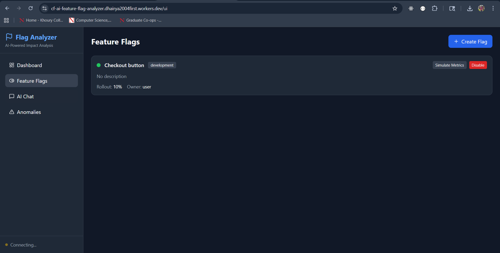
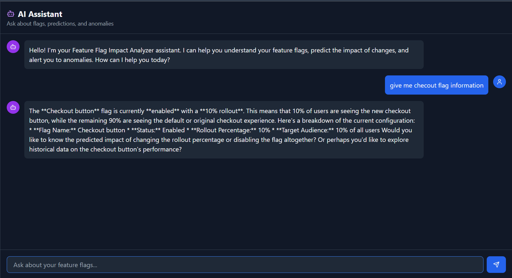

#  Feature Flag Impact Analyzer

An AI-powered feature flag monitoring and impact prediction system built on Cloudflare's edge infrastructure. This application uses **Workers AI (Llama 3.3)**, **Durable Objects** for state management, and provides real-time insights through **WebSocket** connections.

Live demo: https://cf-ai-feature-flag-analyzer.dhairya2004first.workers.dev/ui






##  Features

### Core Capabilities

- **AI-Powered Impact Predictions**: Uses Llama 3.3 70B to analyze feature flag changes and predict their impact on system performance
- **Real-time Anomaly Detection**: Automatically detects error spikes, latency increases, and other anomalies
- **Conversational AI Interface**: Chat with the AI assistant about your feature flags, predictions, and system health
- **Real-time Updates**: WebSocket-based live updates for flags, predictions, and anomalies
- **Persistent State**: SQLite-backed storage via Durable Objects for flags, metrics, and conversation history

### Technical Highlights

| Component | Technology |
|-----------|------------|
| LLM | Workers AI - Llama 3.3 70B Instruct |
| Workflow/Coordination | Durable Objects with SQLite |
| User Interface | Real-time chat via WebSocket + REST API |
| State Management | Durable Objects persistent storage |
| Framework | Hono (lightweight web framework) |

##  Architecture

```
┌─────────────────────────────────────────────────────────────┐
│                    Cloudflare Edge                          │
│  ┌─────────────┐    ┌──────────────────────────────────┐   │
│  │   Worker    │───▶│     Feature Flag Agent           │   │
│  │  (Hono)     │    │     (Durable Object)             │   │
│  │             │    │  ┌────────────────────────────┐  │   │
│  │  - REST API │    │  │  SQLite Database           │  │   │
│  │  - WebSocket│    │  │  - feature_flags           │  │   │
│  │  - Static UI│    │  │  - flag_changes            │  │   │
│  └─────────────┘    │  │  - impact_metrics          │  │   │
│                     │  │  - predictions              │  │   │
│                     │  │  - anomalies                │  │   │
│                     │  │  - conversations            │  │   │
│                     │  └────────────────────────────┘  │   │
│                     │                                   │   │
│                     │  ┌────────────────────────────┐  │   │
│                     │  │  Workers AI                 │  │   │
│                     │  │  (Llama 3.3 70B)           │  │   │
│                     │  │  - Impact Predictions       │  │   │
│                     │  │  - Chat Responses           │  │   │
│                     │  └────────────────────────────┘  │   │
│                     └──────────────────────────────────┘   │
└─────────────────────────────────────────────────────────────┘
```

## Quick Start

### Prerequisites

- [Node.js](https://nodejs.org/) >= 18.0.0
- [Wrangler CLI](https://developers.cloudflare.com/workers/wrangler/install-and-update/)
- Cloudflare account with Workers AI access

### Installation

1. **Clone the repository**
   ```bash
   git clone https://github.com/yourusername/cf_ai_feature_flag_analyzer.git
   cd cf_ai_feature_flag_analyzer
   ```

2. **Install dependencies**
   ```bash
   npm install
   ```

3. **Configure Wrangler**
   
   Update `wrangler.toml` with your KV namespace IDs (optional for local dev):
   ```toml
   [[kv_namespaces]]
   binding = "FLAG_CACHE"
   id = "your-kv-namespace-id"
   preview_id = "your-preview-kv-namespace-id"
   ```

4. **Run locally**
   ```bash
   npm run dev
   ```
   
   The application will be available at `http://localhost:8787`

5. **Access the UI**
   
   Open `http://localhost:8787/ui` in your browser

### Deployment

Deploy to Cloudflare Workers:

```bash
npm run deploy
```

Your application will be deployed to `https://cf-ai-feature-flag-analyzer.<your-subdomain>.workers.dev`

## Usage Guide

### Web Interface

Navigate to `/ui` to access the full-featured web interface:

1. **Dashboard**: Overview of flags, anomalies, and predictions
2. **Feature Flags**: Create and manage feature flags
3. **AI Chat**: Conversational interface for insights
4. **Anomalies**: View detected anomalies

### API Endpoints

| Endpoint | Method | Description |
|----------|--------|-------------|
| `/` | GET | Health check and API info |
| `/api/flags` | GET | List all feature flags |
| `/api/flags` | POST | Create a new feature flag |
| `/api/flags/change` | POST | Record a flag change (triggers AI analysis) |
| `/api/metrics` | POST | Record performance metrics |
| `/api/chat` | POST | Send a chat message |
| `/api/analyze` | POST | Manually trigger flag analysis |
| `/api/anomalies` | GET | List active anomalies |
| `/api/predictions` | GET | List impact predictions |
| `/ws` | WebSocket | Real-time connection |

### Example API Calls

**Create a Feature Flag**
```bash
curl -X POST http://localhost:8787/api/flags \
  -H "Content-Type: application/json" \
  -d '{
    "name": "new-checkout-flow",
    "description": "Redesigned checkout experience",
    "enabled": false,
    "rolloutPercentage": 0,
    "targetEnvironment": "staging",
    "owner": "product-team",
    "tags": ["checkout", "ux"]
  }'
```

**Record a Flag Change**
```bash
curl -X POST http://localhost:8787/api/flags/change \
  -H "Content-Type: application/json" \
  -d '{
    "flagId": "flag-id-here",
    "flagName": "new-checkout-flow",
    "changeType": "enabled",
    "previousValue": { "enabled": false, "rolloutPercentage": 0 },
    "newValue": { "enabled": true, "rolloutPercentage": 10 },
    "changedBy": "john@example.com",
    "environment": "staging"
  }'
```

**Send Metrics**
```bash
curl -X POST http://localhost:8787/api/metrics \
  -H "Content-Type: application/json" \
  -d '{
    "flagId": "flag-id-here",
    "errorRate": 0.5,
    "latencyP50": 45,
    "latencyP99": 120,
    "requestCount": 5000,
    "conversionRate": 3.2,
    "userSatisfactionScore": 4.2
  }'
```

**Chat with AI**
```bash
curl -X POST http://localhost:8787/api/chat \
  -H "Content-Type: application/json" \
  -d '{
    "message": "What are the current risks with our feature flags?",
    "sessionId": "optional-session-id"
  }'
```

### WebSocket Connection

```javascript
const ws = new WebSocket('ws://localhost:8787/ws');

ws.onmessage = (event) => {
  const data = JSON.parse(event.data);
  console.log('Received:', data);
};

// Send chat message
ws.send(JSON.stringify({
  type: 'chat',
  payload: { message: 'Show me active anomalies' }
}));

// Subscribe to anomaly updates
ws.send(JSON.stringify({ type: 'subscribe_anomalies' }));
```

##  AI Capabilities

### Impact Prediction

When a flag change is recorded, the AI analyzes:
- Historical metrics patterns
- Change type (enable/disable/rollout change)
- Environment risk level
- Recent change frequency

And provides:
- **Risk Level**: low, medium, high, critical
- **Risk Score**: 0-100
- **Predicted Impact**: error rate, latency, and user impact changes
- **Recommendations**: actionable suggestions
- **Confidence Score**: prediction reliability

### Anomaly Detection

The system automatically detects:
- **Error Spikes**: >50% increase in error rate
- **Latency Spikes**: >100% increase in P50 latency
- **Conversion Drops**: Significant decrease in conversion rate

### Conversational AI

Ask the assistant about:
- Current flag states and configurations
- Risk analysis for specific flags
- Anomaly explanations and recommendations
- Historical patterns and insights

##  Configuration

### Environment Variables

| Variable | Description | Default |
|----------|-------------|---------|
| `ENVIRONMENT` | Runtime environment | `development` |

### Wrangler Configuration

Key configurations in `wrangler.toml`:

```toml
# Durable Objects for stateful agent
[durable_objects]
bindings = [
  { name = "FEATURE_FLAG_AGENT", class_name = "FeatureFlagAgent" }
]

# SQLite migrations
[[migrations]]
tag = "v1"
new_sqlite_classes = ["FeatureFlagAgent"]

# Workers AI binding
[ai]
binding = "AI"
```

##  Testing

Run the test suite:

```bash
npm test
```

### Manual Testing Steps

1. **Start the dev server**: `npm run dev`
2. **Open the UI**: Navigate to `http://localhost:8787/ui`
3. **Create a flag**: Click "Create Flag" and fill in the details
4. **Simulate metrics**: Click "Simulate Metrics" on a flag card
5. **Toggle flag**: Click "Enable" or "Disable" to trigger AI prediction
6. **Check predictions**: View the Dashboard for impact predictions
7. **Chat with AI**: Use the AI Chat section to ask questions

##  Project Structure

```
cf_ai_feature_flag_analyzer/
├── src/
│   ├── index.ts        # Main Worker entry point with Hono router
│   ├── agent.ts        # Durable Object agent with AI integration
│   └── types.ts        # TypeScript type definitions
├── wrangler.toml       # Cloudflare Workers configuration
├── package.json        # Node.js dependencies
├── tsconfig.json       # TypeScript configuration
├── README.md           # This file
└── PROMPTS.md          # AI prompts used in development
```


